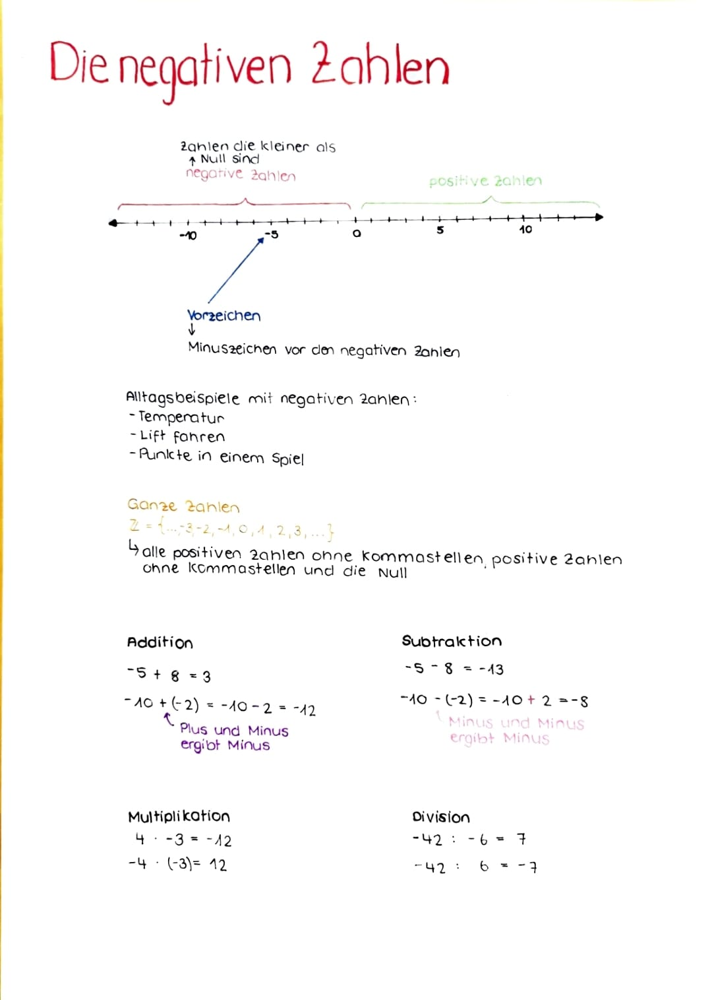

# Einstieg (20 Min.)

## Entwicklung eigener Textaufgaben: 

Die SuS bilden Vierergruppen und setzen sich gemeinsam an einen Tisch. Nun muss jeder für sich eine eigene Textaufgabe zum Thema der negativen Zahlen entwickeln. (Vorgabe: Es darf sich nicht um eine Aufgabe handeln, die sich mit Temperatur / Thermometer befasst → Appell an die Kreativität der SuS)

Sobald die alle SuS der Gruppe min. eine Aufgabe kreiert und eine Lösung erstellt haben. Können die Aufgaben unter den Gruppenmitgliedern ausgetauscht werden. So dass jeder SuS eine Aufgabe einer Mitschülerin oder eines Mitschülers löst. 

Je nach dem, wie selbstständig die SuS arbeiten, kann den SuS vorgegeben werden, dass sie die selbstkreierten Aufgaben vor dem Austausch mit der LP besprechen müssen.   

Bei Unklarheiten oder nicht übereinstimmenden Ergebnissen kann eine Beispielaufgabe anschliessend auch mit der gesamten Klasse besprochen werden. 

⇒ Es ist das Ziel, dass sich die SuS etwas stärker mit dem Alltagsbezug der negativen Zahlen auseinandersetzten und sich selbst eine Situation überlegen, in der negative Zahlen eine Rolle spielen. Hierbei soll zudem ihre Sprachkenntnisse verwendet und gefördert werden.

Für das Ausführen dieser Aufgabe, wird den SuS genügend Zeit gelassen, damit die SuS ihrer Kreativität freien lauf lassen können (oder etwas länger über geeignete Beispiele nachdenken). 

# Hauptteil (10+15 Min.)

## Einführung in die Multiplikation (7 Min.)

$-5 \cdot 4$

$-8 \cdot 3$

$7 \cdot (-7)$

$-4 \cdot (-2)$

## Einführung in die Division (8 Min.)

$12 \div (-9)$

$-3 \div 5$

$-5 \div (-4)$

::: {#exr-line}

## Übungsaufgaben Multiplikation und Division (15 Min.)

Berechne!

1. $-5 \cdot 3 =$
2. $-18 \div 3 =$
3. $28 \div (-7) =$
4. $-7 \cdot (-4) =$
5. $-36 \div (-6) =$
6. $6 \cdot (-8) =$
7. $-9 \cdot 5 =$
8. $-45 \cdot 5 =$
9. $-3 \cdot (-2) =$
10. $56 \div (-8) =$
11. $-72 \div 9 =$
12. $10 \cdot (-7) =$
13. $-50 \div (-10) =$
14. $-4 \cdot 6 =$
15. $-11 \cdot (-3) =$
16. $48 \cdot (-6) =$
17. $-30 \div (-5) =$
18. $12 \cdot (-5) =$
19. $-8 \cdot 9 =$
20. $15 \cdot (-2) =$
21. $42 \div (-7) =$
22. $-6 \cdot (-6) =$
23. $14 \cdot (-3) =$
24. $-24 \div 6 =$
25. $36 \div (-12) =$
26. $-10 \cdot 4 =$
27. $7 \cdot (-7) =$
28. $-81 \div (-9) =$

:::

PAUSE

## Üben (25 Min.)
Arbeiten Sie weiter an den Aufgaben oben oder am Skript unten.

## Abschluss / Ergebnissicherung (20 Min.)

Auftrag: Erstelle auf einem leeren A4-Blatt ein Lernplakat, welches das Gelernte zum Thema negative Zahlen zusammenfasst. Enthalten muss es wichtige Regeln, Begriffe und dazugehörige Definitionen, Darstellungen und Beispiele. Des Weiteren solltest du mit verschiedenen Farben arbeiten, in gut leserlicher Schrift schreiben und den zur Verfügung gestellten Platz des Papieres ausnützen.

So könnte ein solches Mini-Plakat aussehen: 
{height=300px}