# Lektion 1 - Was ist schon wieder ein Bruch?

## Einführungsaufgabe (15 min) 

* SuS lösen die Aufgabe in PA.
* Besprechung der Lösungsvorschläge im KV.

## Spiel "Bruchpaare" (25 min)

# SuS lesen die Theorie der Lernumgebung (5 min)

# Lektion 2 - Verschieden Brüche, die alle denselben Wert haben

* 5'Brüche und Dezimalzahlen auf dem Zahlenstrahl einordnen:
    * Jeder SuS ordnet seine Brüche/Dezimalzahlen auf dem Zahlenstrahl ein.
* 20' Brüche und Dezimalzahlen auf dem Zahlenstrahl korrigieren:
    * Die SuS korrigieren gemeinsam mit der LP den Zahlenstrahl.

* 20'Arbeiten in der Lernumgebung:
    * SuS ordnen 2-3 selbstgewählte Brüche mit Dezimalzahlen auf dem Zahelnstrahl ein.
    * SuS lösen die Aufgaben in der Lernumgebung.

Bemerkung: Hier könnte sich der Verlauf der Lektion etwas ändern. Eventuell kann schon mit der Einführung in das Thema Kürzen und dem Arbeiten an den Aufgaben begonnen werden. Das lösen der Aufgaben kann gut unterbrochen werden und in der nächsten Doppellektion wieder aufgenommen werden.

# Lektion 3 Brüche kürzen und erweitern

* 10 	Einführung in das Thema Kürzen:
    * LP führt das Thema an der Wandtafel ein.
    * zwei Beispiele im KV lösen.
* 15' Arbeiten in der Lernumgebung:
    * SuS lösen die Aufgaben in der Lernumgebung.
* 10'Einführung in das Thema Erweitern:
    * LP führt das Thema gemeinsam mit 1-2 SuS an der Wandtafel ein.
    * zwei Beispiele im KV lösen.
* 10' Arbeiten in der Lernumgebung:
    * SuS lösen die Aufgaben in der Lernumgebung.

# Lektion 4 - Brüche addieren und subtrahieren
* 10' 	Arbeiten in der Lernumgebung:
    * SuS lesen die Theorie zur Addition in der Lernumgebung.
* 10'Das Rechteckmodell:
    * Die LP zeigt den SuS wie die Addition mit Hilfe des Rechteckmodells funktioniert.
    * Ein weiteres Beispiel lösen 1-2 SuS gemeinsam mit der Klasse und der LP an der Wandtafel.
* 10' Arbeiten in der Lernumgebung:
    * SuS lösen die Aufgaben zur Addition in der Lernumgebung.
* 10' Arbeiten in der Lernumgebung:
    * SuS lesen die Theorie zur Subtraktion in der Lernumgebung.
    * SuS lösen die Aufgaben zur Subtraktion in der Lernumgebung.
* 5' Lösen der Alltagsaufgabe, welche zu Beginn dieser Lernumgebung thematisiert wurde.

# Skript?

##  Was ist schon wieder ein Bruch?

### Spiel - Bruchpaare

#### Wie wird gespielt?

Spiele das Spiel zu zweit, beispielsweise mit deiner Pultnachbarin oder deinem Pultnachbarn.

#### Ziel des Spiels
Jede Spielerin oder jeder Spieler versucht, so viele Bruchpaare wie möglich zu finden.

#### Spielablauf
Die erste Spielerin oder der erste Spieler deckt zwei Karten auf.
Wenn die beiden Karten denselben Bruch darstellen (ein Paar bilden), darfst du die Karten nehmen und einen weiteren Zug machen.
Stimmen die Karten nicht überein, musst du sie wieder verdecken, und deine Pultnachbarin oder dein Pultnachbarn ist an der Reihe.

#### Tipp!
Merken, wo welche Karte liegt, um bei späteren Zügen einfacher ein Bruchpaar zu finden.

#### Spielende
Das Spiel endet, wenn alle Bruchpaare gefunden wurden. Die Spielerin oder der Spieler mit den meisten gesammelten Paaren gewinnt.

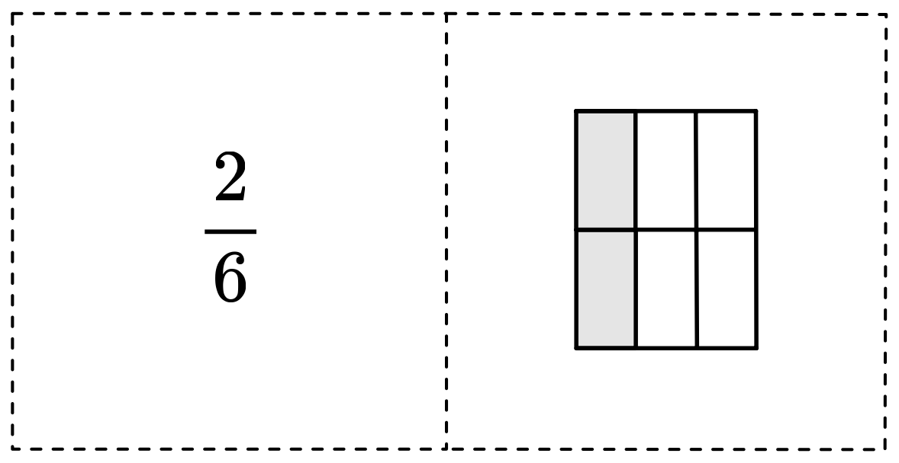

## Der Bruch

Ein Bruch ist eine Zahl, welche aus zwei Teilen besteht. Der Bruch zeigt an, wie viele Teile eines Ganzen gemeint sind.

* Der Zähler gibt an, wie viele Teile des Ganzen ausgewählt werden.
* Der Nenner gibt an, in wie viele gleich grosse Teile das Ganze aufgeteilt ist.

Beispiel:

Wird ein Ganzes in vier Teile geteilt und werden davon drei ausgewählt, so ist das der Bruch $\frac{3}{4}$.

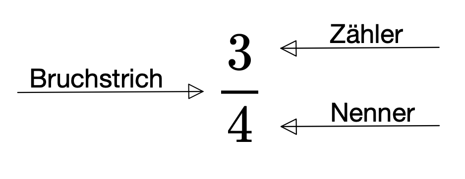

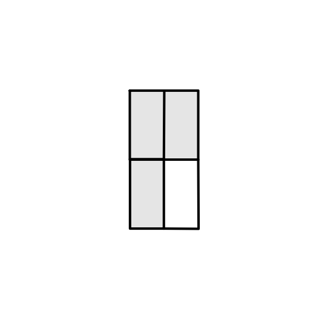

[PDF Spiel Bruchpaare](Spiel%20Bruchpaare.pdf)

##  Verschiedene Brüche, die alle denselben Wert haben 

### Der Zahlenstrahl

Ordne verschiedene Brüche auf dem Zahlenstrahl ein.

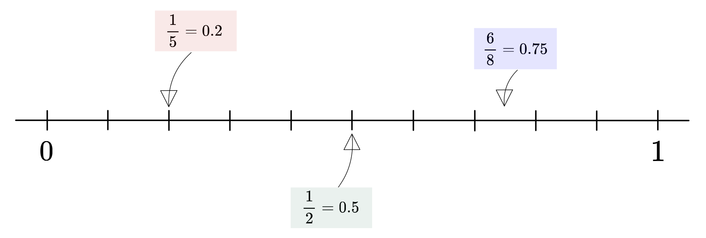

#### Bemerke!

Für jeden Bruch gibt es viele (sogar unendlich viele) verschiedene Brüche, die alle denselben Wert, sprich dieselbe Grösse haben.

## Schreibe in Dezimalzahl.

### g

a. $\frac{1}{4} =$
b. $\frac{1}{8} =$
c. $\frac{1}{2} =$
d. $\frac{2}{4} =$
e. $\frac{1}{5} =$
f. $\frac{3}{4} =$
g. $\frac{2}{4} =$
h. $\frac{2}{5} =$
i. $\frac{2}{2} =$
j. $\frac{4}{8} =$

### e

a. $\frac{1}{3} =$
b. $\frac{3}{8} =$
c. $\frac{4}{5} =$
d. $\frac{6}{8} =$
e. $\frac{1}{9} =$
f. $\frac{1}{10} =$
g. $\frac{8}{16} =$
h. $\frac{4}{10} =$
i. $\frac{3}{12} =$
j. $\frac{6}{15} =$

### \*

a. $\frac{2}{3} =$
b. $\frac{1}{6} =$
c. $\frac{3}{9} =$
d. $\frac{2}{14} =$
e. $\frac{4}{12} =$
f. $\frac{10}{18} =$

## Brüche und Dezimalzahlen für den Zahlenstrahl

[Druckvorlage](brueche_zahlenstrahl.pdf)

## Brüche kürzen und erweitern

### Kürzen

Kürzen heisst Zähler **und** Nenner durch die gleiche Zahl dividieren. **Beachte:** Durch das Kürzen ändert sich der Wert des Bruches nicht.

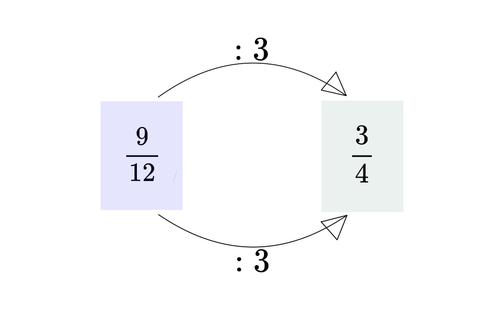 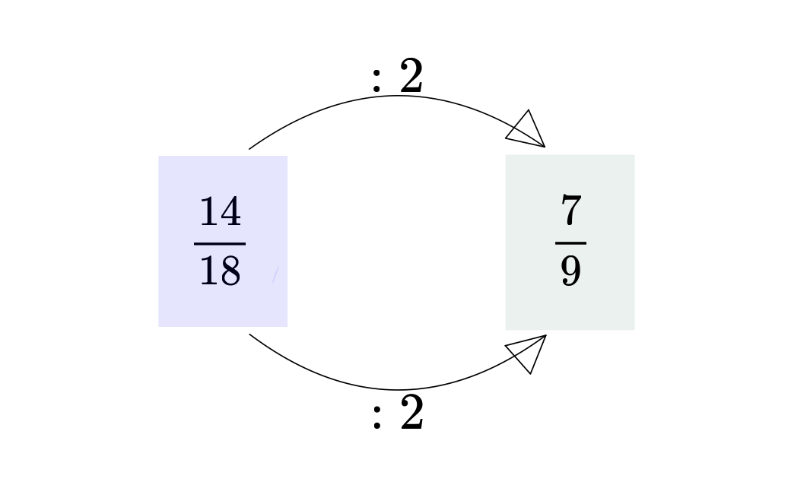

## Zeichne einen Pfeil zu dem gekürzten Bruch.

### g

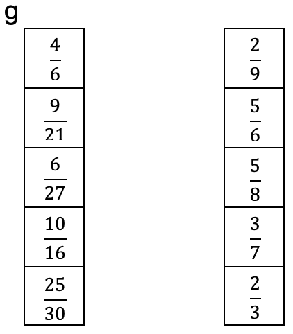

### e

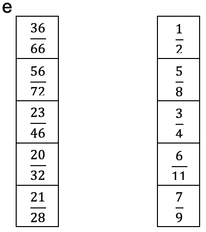

### e

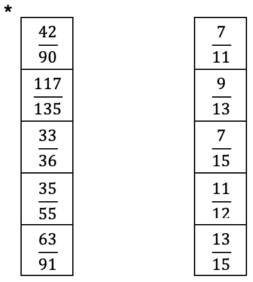

### Mit welcher Zahl wurde gekürzt?

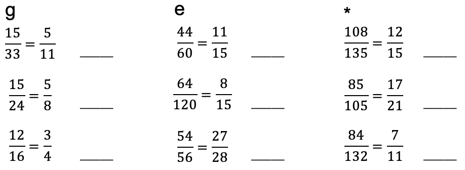

### Kürze so weit wie möglich

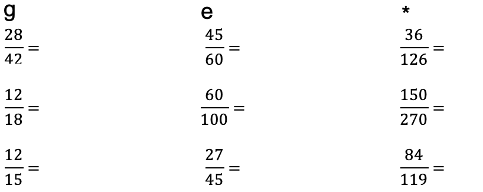

## Erweitern

Erweitern heisst Zähler **und** Nenner mit der gleichen Zahl multiplizieren. **Beachte:** Durch das Erweitern ändert sich der Wert des Bruches nicht.

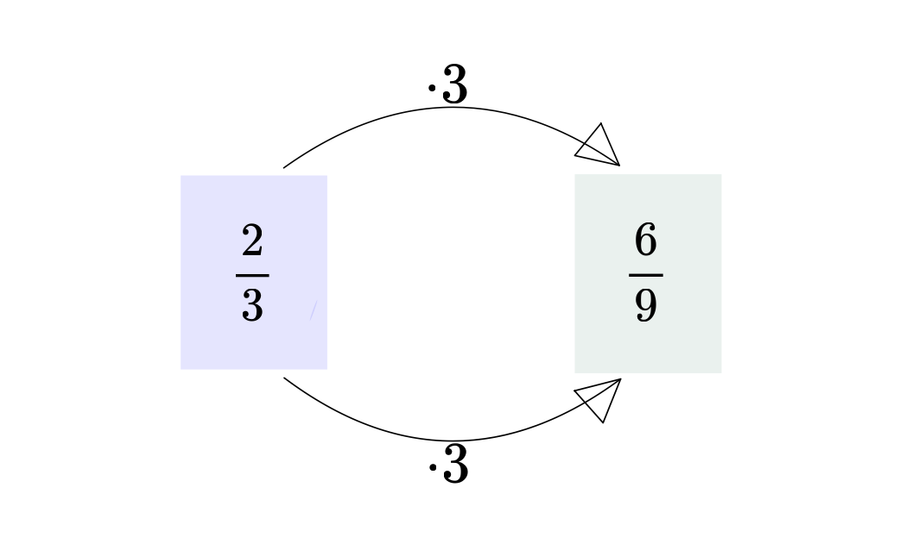 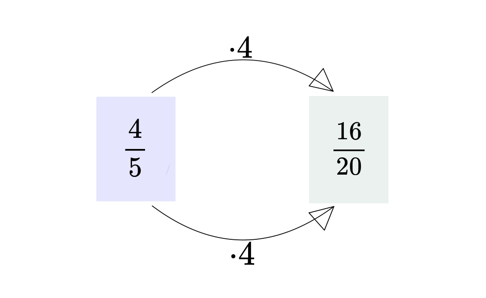

### Zeichne einen Pfeil zu dem erweiterten Bruch.

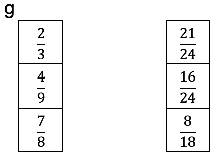

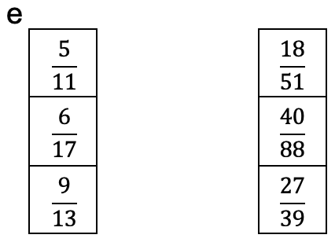

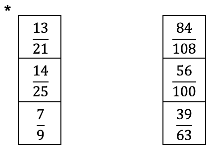

### Mit welcher Zahl wurde erweitert?

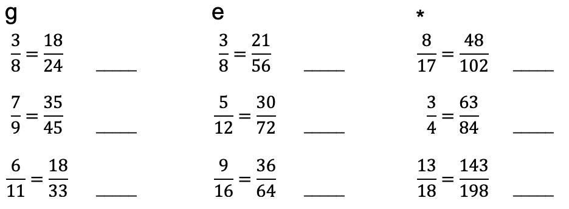

##  Brüche addieren und subtrahieren 

### Addition

Addition von Brüchen mit **gleichem** Nenner.

Addiere die Zähler und behalte die Nenner bei.

$\frac{1}{3}+\frac{1}{3}=\frac{1+1}{3}=\frac{2}{3}$

$\frac{2}{7}+\frac{4}{7}=\frac{2+4}{7}=\frac{6}{7}$

** Achtung!** Vergiss nicht zu kürzen.

$\frac{1}{8}+\frac{3}{8}=\frac{1+3}{8}=\frac{4}{8}=\frac{1}{2}$

Addition von Brüchen mit **verschiedenen** Nenner.

1. Erweitere die Nenner auf einen gemeinsamen Nenner. Dieser gemeinsame Nenner heisst Hauptnenner.
2. Bestimme die Zahl, mit welcher du den Bruch erweitern musst, indem du den Hauptnenner durch den Nenner des Bruches dividierst.
3. Erweitere die Brüche.
4. Addiere die Zähler und behalte den Hauptnenner bei.
5. Kürze, wenn möglich.

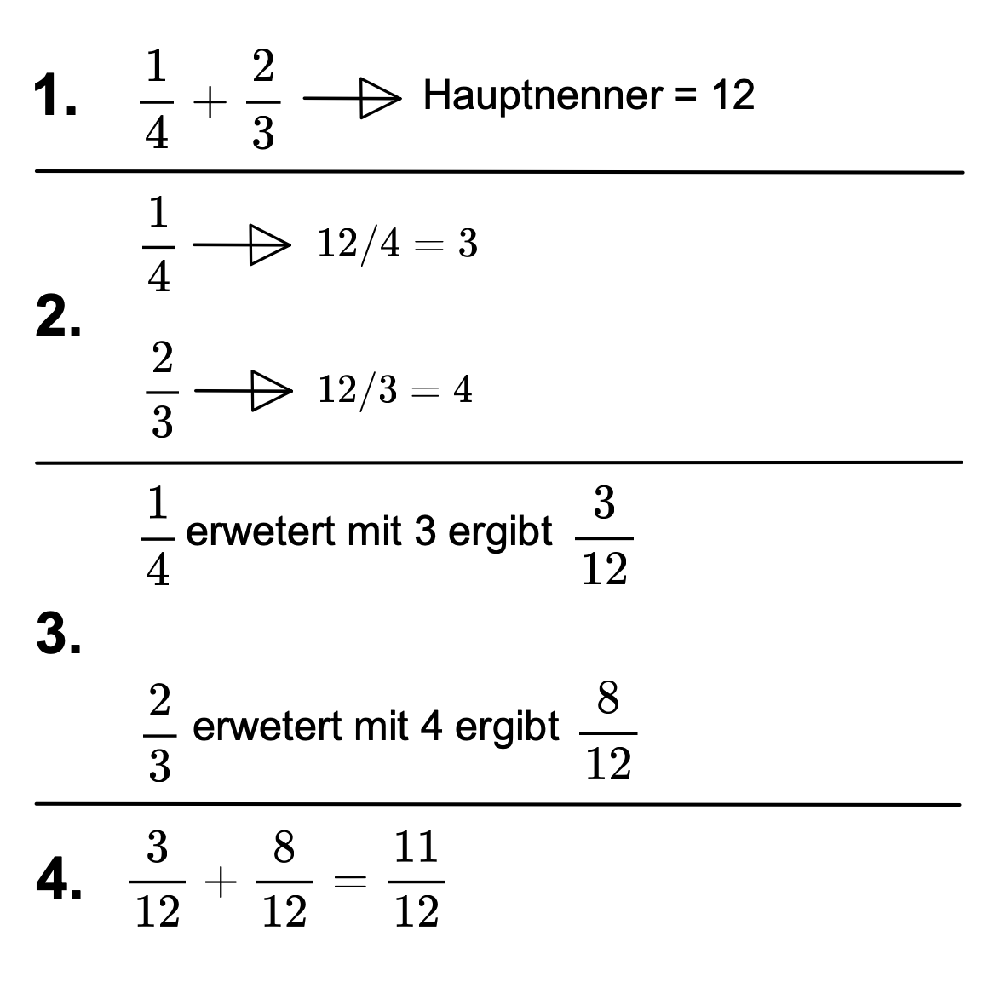

So kannst du dein Rechnungsweg notieren:

$\frac{1}{4}+\frac{2}{3}=\frac{3}{12}+\frac{8}{12}=\frac{11}{12}$

Du kannst mit Hilfe des Rechteckmodells ein Addition veranschaulichen.

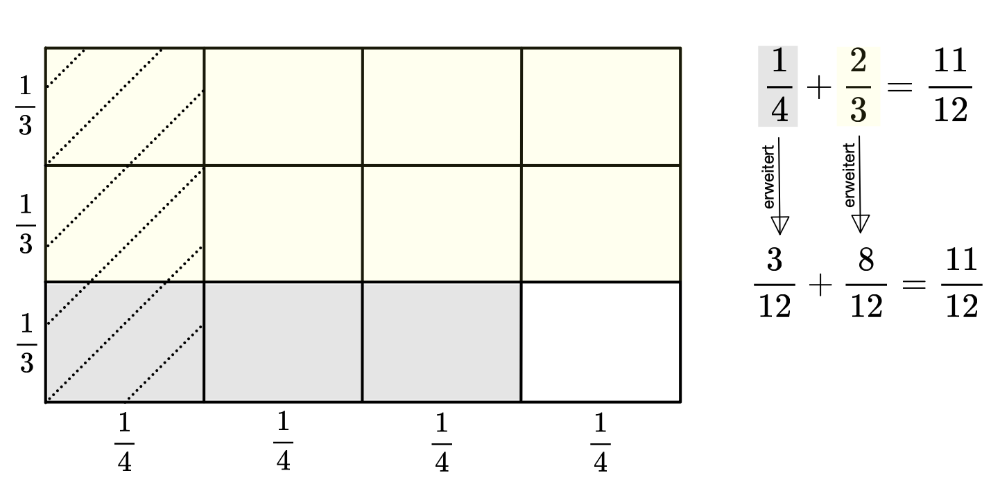

Erklärt euch gegenseitig wie man Brüche mit dem Rechteckmodell addieren kann. Mach dir Notizen!

Stellt mit dem Rechteckmodell zwei weitere Bruchadditionen dar.

Addiere.

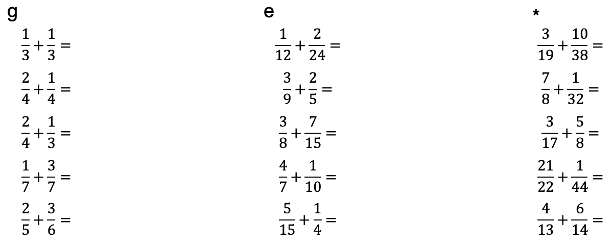

### Subtraktion

Subtraktion von Brüchen mit **gleichen** Nenner.

Subtrahiere die Zähler und behalte die Nenner bei.

$\frac{3}{5}-\frac{1}{5}=\frac{3-1}{5}=\frac{2}{5}$

$\frac{4}{7}-\frac{3}{7}=\frac{4-3}{7}=\frac{1}{7}$

**Achtung!** Vergiss nicht zu kürzen

$\frac{3}{8}=\frac{3-1}{8}=\frac{2}{8}=\frac{1}{4}$

Subtraktion von Brüchen mit **verschiedenen** Nenner.

1. Erweitere die Nenner auf einen gemeinsamen Nenner. Dieser gemeinsame Nenner heisst Hauptnenner.
2. Bestimme die Zahl, mit welcher du den Bruch erweitern musst, indem du den Hauptnenner durch den Nenner des Bruches dividierst.
3. Erweitere die Brüche.
4. Subtrahiere die Zähler und behalte den Hauptnenner bei.
5. Kürze, wenn möglich.

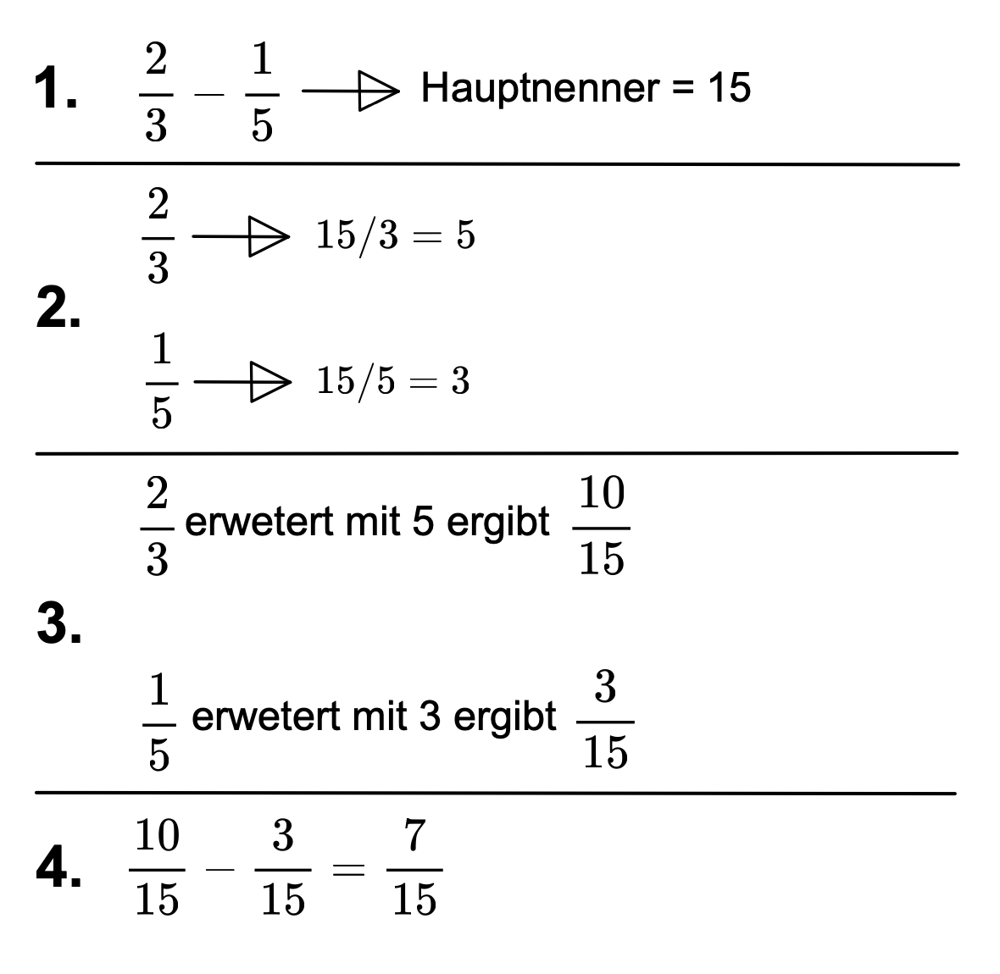

So kannst du dein Rechnungsweg notieren:

$\frac{2}{3}-\frac{1}{5}=\frac{10}{15}-\frac{3}{15}=\frac{7}{15}$

Subtrahiere

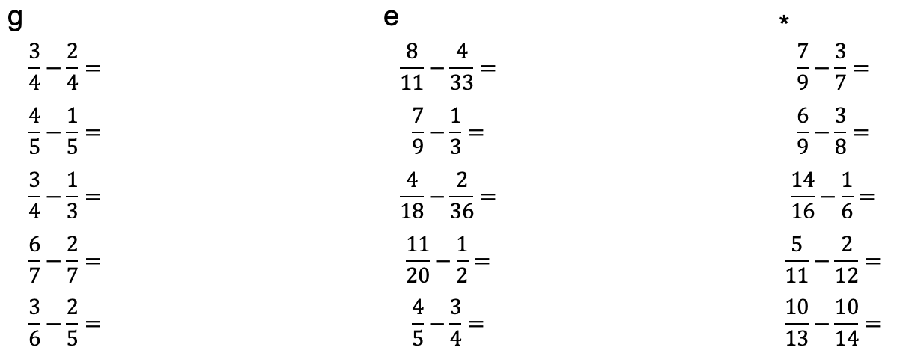

# Lehrpersonensonkommentar

## Voraussetzungen

Diese Lernumgebung befasst sich mit dem Thema Brüche. Die folgenden Themen werden im Detail behandelt.

* Repetition, was ist ein Bruch?
* Wert (Grösse) eines Bruches
* Brüche kürzen und erweitern
* Brüche addieren und subtrahieren

Es wird vorausgesetzt, dass der Begriff „Bruch” kein Fremdwort für die Schüler*innen ist. Die Schüler*innen sollten bereits über grundlegende Kenntnisse zum Thema Brüche verfügen. Dies stützt sich auf dem Lehrplan 21, da die Kompetenz MA 1. A. 3. f bereits thematisiert wurde. Sie gehört zu den Grundanforderungen des Zyklus 2 und folgt nach dem Orientierungspunkt. Die Kompetenz lautet konkret: „Die Schüler und Schülerinnen können Brüche mit den Nennern 2, 3, 4, 5, 6, 8, 10, 20, 50, 100 am Rechteckmodell kürzen, erweitern, addieren und subtrahieren” (Deutschschweizer Erziehungsdirektoren-Konferenz, 2016, S. 12).

Nach Abschluss der Lernumgebung sollten die Schüler*innen folgende Kompetenzen beherrschen:

* Ich weiss, dass jeder Bruch einen bestimmten Wert besitzt und dieser in einer Dezimalzahl darstellbar ist.
* Ich kann Brüche auf dem Zahlenstrahl einordnen.
* Ich kann Brüche kürzen und erweitern.
* Ich kann Brüche addieren und subtrahieren.

Ja, das kann ich perfekt (🙂). Ja, aber zum Teil habe ich noch etwas Mühe (😬).
Nein, da muss ich noch mehr üben (🙁).

Diese Tabelle dient zugleich der Selbsteinschätzung/Selbstevaluation der Schüler*innen. Da diese Lernumgebung nur ein Teil des Themas Brüche beinhaltet und in einer weiteren Lernumgebung die Multiplikation und Division von Brüchen thematisiert wird, könnte abschliessend zu diesen zwei Lernumgebungen eine Lernkontrolle stattfinden. Eine Alternative dazu könnte ein Produkt sein, beispielsweise in Form eines Merkhefteintrages.

## Allgemeines

Die Lernumgebung beinhaltet Theorie und die dazupassenden Übungsaufgaben. Zu jedem Thema gibt es einen gemeinsamen Einstig mit den Schüler*innen. Die Übungsaufgaben sind folgendermassen gekennzeichnet: g: grundlegend, e: erweitert, *: Expert. Wenn Schüler*innen auf der jeweiligen Stufe Schwierigkeiten bekunden, empfiehlt es sich zusätzlich weitere Aufgaben mit ähnlichem Schwierigkeitsgrad zu lösen. Das Gleiches gilt für leistungsstärkere Schüler*innen. Sie sollten mit weiteren Aufgaben gefördert werden. Die Aufgaben und Spiele, welche in Papierform gebraucht werden, können als PDF-Datei heruntergeladen werden.

## Was ist schon wieder ein Bruch?

Um den Schüler*innen zu zeigen, wofür das Bruchrechnen wichtig ist, kann man eine anspruchsvolle alltagsbezogene Aufgabe stellen. Wenn der Alltagsbezug geschickt die Interessen der Schüler*innen anspricht, fördert dies deren Motivation und Aufmerksamkeit.

Zum Beispiel: Angenommen, du möchtest einen Smoothie aus verschiedenen Getränken und Säften herstellen. Du hast folgende Mengen zur Verfügung: 1/3 Liter Orangensaft, 2/5 Liter Apfelsaft, 1/4 Liter Traubensaft und 1/6 Waser.

1. Wie viel Saft hast du insgesamt?
2. Du trinkst nur 3/4 von dem Saft. Wieviel hast du noch übrig?

Eine solche Aufgabe können die Schüler*innen vorerst kurz versuchen zu lösen. Anschliessend folgt eine Besprechung im Klassenverband, um die Lösungsvorschläge der Schüler*innen zu sammeln. Es ist nicht das Ziel, dass die Schüler*innen bereits die Aufgabe lösen, sondern die Lehrperson kann daraus schliessen, wieviel Wissen die Schüler*innen im Thema Brüche bereits besitzen.

Danach kann das Spiel „Bruchpaare” gespielt werden. Abschliessend können die Schüler*innen den Theorieblock lesen.

## Verschiedene Brüche, die alle denselben Wert haben

Bei diesem Thema können die Schüler*innen die Grösse eines Bruches erkunden. Sie entdecken, dass verschiedene Brüche den gleichen Wert haben. Zudem erfolgen bereits erste Annäherungen zum Kürzen und Erweitern.

Die Lehrperson erstellt einen grossen Zahlenstrahl auf dem Boden des Klassenzimmers. Dies funktioniert sehr einfach mit Malerklebeband. Nun sollen die Schüler*innen Brüche und Dezimalzahlen einordnen. Entweder gibt man die Brüche und Dezimalzahlen vor oder die Schüler*innen schrieben selbst welche auf einen Zettel. Wichtig zu beachten ist, dass der Bruch jeweils auch in dessen Dezimalzahl vorhanden ist. So erkennen die Schüler*innen den Zusammenhang zwischen Bruch und Dezimalzahl. Nach dem Einordnen wird der Zahlenstrahl zusammen im Klassenverband korrigiert. Dabei sollen die Schüler*innen falsch eingeordnete Zettel, unter Aufsicht und dem O.K. der Lehrperson, neu anordnen.

Abschliessend können die Schüler*innen zwei bis drei selbstgewählte Brüche mit Dezimalzahl in der Lernumgebung einordnen und die Aufgaben lösen.

## Brüche kürzen und erweitern

### Kürzen

Zuerst kann die Lehrperson den Schüler*innen mitteilen, dass das Kürzen und Erweitern der Brüche ein bedeutender Punkt ist, welcher bei der Addition und Subtraktion zentral wird (Sinnvermittlung). Daraufhin notiert die Lehrperson einen Bruch mit grossem Zähler und grossem Nenner, beispielsweise 24/48, an die Wandtafel. Sie fragt die Klasse nach dem Wert dieses Bruches, sprich, welche Dezimalzahl diesen Bruch darstellt. Da dies ein einfacher Bruch ist, ist die Wahrscheinlichkeit sehr gross, dass jemand die Antwort weiss. Anschliessend fragt die Lehrperson die Klasse, ob sie noch weitere Brüche kennen mit dem Wert 0,5. Anhand den genannten Brüchen kann die Lehrperson das Kürzen, wie in der Lernumgebung dargestellt, vorzeigen. Nachfolgend können zwei weitere Beispiele im Klassenverband gelöst werden, bevor die Schüler*innen die Aufgaben in der Lernumgebung lösen.

### Erweitern

Die Einführung in das Erweitern erfolgt nach den gleichen Schritten wie das Kürzen. Diese Einführung könnte durchaus mit 1-2 „fitten” Schüler*innen gemeinsam an der Wandtafel gemacht werden. Dadurch wird den Schüler*innen Verantwortung übertragen und sie finden sich in neuen Situationen wieder. Dies kann positive Auswirkungen auf den Unterricht haben. Vielleicht wirkt es motivierend auf Mitschüler*innen, wenn gleichaltrige Themen vermitteln oder sie sind zumindest aufmerksamer. Schliesslich lesen die Schüler*innen die Theorie und lösen die Aufgaben in der Lernumgebung.

## Brüche addieren und subtrahieren

### Addition

Hier lesen die Schüler*innen den Theorieblock in der Lernumgebung aufmerksam durch. Danach zeigt die Lehrperson an der Wandtafel, wie das Lösen einer Addition mit dem Rechteckmodell funktioniert. In zwei weiteren Beispielen sollen bereits wieder Schüler*innen nach vorne kommen, um gemeinsam die Rechteckmodelle zu erstellen. Dann lösen die Schüler*innen die Aufgaben in der Lernumgebung.

### Subtraktion

Wiederum lesen die Schüler*innen zuerst den Theorieblock, können jedoch danach selbständig mit dem Lösen von Aufgaben beginnen. Auf eine Veranschaulichung mit dem Rechteckmodell habe ich bei der Subtraktion bewusst verzichtet. Im Fokus stehen die gleichen Abläufe wie bei der Addition mit der Ausnahme das Zähler plus Zähler zu Zähler minus Zähler wird.

## Anwenden von Gelerntem ausserhalb von Lernsituationen

Nach dieser Lernumgebung und der darauffolgenden beherrschen die Schüler*innen das Operieren mit Brüchen. Bereits nach dieser oder nach beiden Lernumgebungen kann das Gelernte ausserhalb von Lernsituationen angewendet werden. Eine Möglichkeit in der Mathematik ist das Lösen von Fermi-Fragen. Von Vorteile wäre natürlich wenn die Schüler*innen beim Lösen der Fermi-Frage auf Brüche treffen würden. Zu beachten ist, dass die Transferierbarkeit von Wissen abhängig ist von den Ähnlichkeiten zwischen Basis- und Zielaufgaben, den Ähnlichkeiten der Kontexte und natürlich von dem Vorwissen und der Motivation der Lernenden.

 

Literatur:

Deutschschweizer Erziehungsdirektoren-Konferenz. (2016). Lehrplan 21: Broschüre Mathematik (S. 12). D-EDK.

# Vertiefung

## Lernphasen

Im ersten Teil meiner Vertiefung möchte ich mit dem Verlauf eines Lernprozesses beschäftigen. Dazu fokussiere ich mich auf die zwei Strukturen, in welche die Lektionen aufgeteilt werden können. Einerseits ist das die Sicht- und Oberflächenstruktur, welche den zeitlichen Lektionsverlauf beschreibt, anderseits die Tiefenstruktur, welche den Lernprozess ersichtlich macht (Meyer, 2013).

 
### Sicht- und Oberflächenstruktur

Die Sicht- und Oberflächenstruktur ist die zeitliche Gliederung des Unterrichts. Eine mögliche Gliederung ist die Aufteilung der Lektion in Einstieg, Hauptteil und Schluss.

Der Einstieg dient dazu, das Interesse der Schüler*innen zu wecken. Gleichzeitig wird ihnen das Unterrichtsthema vorgestellt. Darüber hinaus kann der Einstieg genutzt werden, um die Aufmerksamkeit der Schüler*innen zu fokussieren und das Thema für sie sinnhaft zu machen.

Im Hauptteil einer Lektion wird der Kerninhalt vermittelt. Hier wird das eigentliche Thema der Lektion erarbeitet, vertieft und angewendet. Die Schüler*innen beschäftigen sich mit dem Thema, sei es durch Erklärungen, Diskussionen, Übungen oder praktische Aufgaben.

In einem Abschluss kann das Gelernte in einem Rückblick sichtbar gemacht werden (Ergebnissicherung).

### Tiefenstruktur

Der Lernprozess ist schlecht in einer einzigen Lektion oder Doppellektion ersichtlich, sondern er offenbart sich erst nach 2-3 Stunden. Der Lernprozess lässt sich am besten in Lernphasenmodelle aufzeigen. Solche Lernphasenmodelle beziehen sich auf den Lernprozess und nicht auf die zeitliche Gliederung. Ich werde nun meine Lernumgebung mit Hilfe des PADUA Modells (Aebli, 2011) analysieren.

| **Schritt**                                      | **Beschreibung**                                                                                                                                                                                       |
|--------------------------------------------------|---------------------------------------------------------------------------------------------------------------------------------------------------------------------------------------------------------|
| **Problemlösendes Aufbauen einer Struktur**       | Wenn das Lernen neuer Inhalte von lebendig empfundenen Problemen ausgeht, kann dadurch das Interesse der Schüler*innen geweckt werden. Neue Inhalte werden problemlösend und fragend, entwickelnd gelernt. Gemeinsam mit den Schüler*innen wird eine Struktur erarbeitet, indem bekannte und neue Elemente schrittweise zusammengefügt werden. |
| **Durcharbeiten einer Struktur**                 | Die neuen Inhalte werden in neue Zusammenhänge gebracht, um eine andere Sicht auf dieselbe Sache zu ermöglichen.                                                                                         |
| **Üben und Wiederholen**                         | Ziel ist Sicherheit. Üben ist ein zentraler Lernschritt, der oft vergessen wird. Dem Vergessen wird nur durch Üben entgegengesetzt.                                                                      |
| **Anwenden der Struktur in neuen Problemsituationen** | Schüler*innen können die neu erworbenen Inhalte in neuen Situationen anwenden. Dadurch wird eine Verbindung zwischen Lernen und Leben hergestellt. Gesicherte Lerninhalte werden auf reale Lebenssituationen angewendet und geprüft.   |

PA: Als Einstieg in die Lernumgebung wird den Schüler*innen eine anspruchsvolle alltagsbezogene Aufgabe gestellt. Inwieweit dies ein lebendig empfundenes Problem darstellt, ist sehr abhängig von den Interessen der Schüler*innen. Je besser die Lehrperson ihre Schüler*innen kennt, desto besser kann sie eine alltagsbezogene Aufgabe formulieren, welche möglichst viele Schüler*innen anspricht.

Bei dem Thema „Brüche kürzen und erweitern” werden die Inhalte problemlösend beziehungsweise fragend, entwickelnd vermittelt. Hier wird an bereits vorhandenen Strukturen angeknüpft. Das bekannte Wissen, über den Wert eines Bruches, kann mit dem neuen Wissen, dem Kürzen und Erweitern, zusammengefügt werden. Bei dem Thema „Verschieden Brüche, die alle denselben Wert haben” werden die neuen Inhalte nicht problemlösend beziehungsweise fragend, entwickelnd vermittelt, jedoch gemeinsam mit den Schüler*innen erarbeitet.

D: Diese Lernumgebung ist aufbauend entwickelt. Alle erlernten Inhalte müssen im nächsten Thema angewendet werden. Dadurch werden die Inhalte in neue Zusammenhänge gebracht.

U: Übung macht den Meister. Gerade in der Mathematik ist das Üben sehr wichtig. Die Lernumgebung bietet verschiedene Aufgabenstellungen. Diese sind keine definitiven Aufgaben. Je nach Klasse und Schüler*innen können weitere und verschieden Aufgaben bearbeitet werden.

A: Nun kann das gelernte, in der zu Beginn der Lernumgebung gestellten Aufgabe, angewendet werden. Wie bereits im Lehrpersonenkommentar erwähnt, ist eine weitere Option mit den Schüler*innen Fermi-Fragen zu lösen.

##  Motivation
Im zweiten Teil meiner Vertiefung befasse ich mich mit dem Thema Motivation. Motivation setzt sich aus einem Motiv, einem dauerhaften Bedürfnis, sowie einem äusseren Anreiz, der das Motiv anspricht, zusammen.

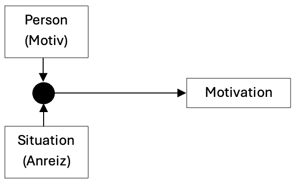

### Intrinsische und extrinsische Motivation

In der Pädagogik ist die Unterscheidung zwischen intrinsischer und extrinsischer Motivation von Bedeutung. Intrinsische Motivation meint das Handeln um seiner selbst willen. Die Motivation entsteht aus der Person heraus und ist unabhängig von äusseren Faktoren wie Belohnungen oder Bestrafungen. Die Schüler*innen lernen aus Freude an der Tätigkeit selbst oder aufgrund des Interessens am Inhalt. Extrinsische Motivation meint die Verhaltenssteuerung durch äussere Anreize wie Belohnungen, Bestrafungen, gute Noten oder Anerkennung. Für die Schüler*innen ist das Lernen nur ein Mittel zum Zweck.

Ein Beispiel für intrinsische Motivation ist: Max ist ein Schüler, der sich gerne mit mathematischen Problemen beschäftigt. Er liebt es, neue Lösungswege zu entdecken und knifflige Aufgaben zu lösen. Die Mathematik fasziniert ihn. Deshalb übt Max freiwillig in seiner Freizeit Mathematik, nicht um bessere Noten zu bekommen, sondern weil ihm das Denken in Zahlen und Formeln Spass macht.

Ein Beispiel für extrinsische Motivation ist: Lisa lernt fleissig für ihre Mathematikprüfung. Sie möchte unbedingt eine gute Note bekommen, damit ihre Eltern Stolz auf sie sind. In diesem Fall ist der Hauptantrieb nicht das Interesse an der Mathematik, sondern die Aussicht auf Anerkennung und Belohnung von aussen.

Die intrinsische Motivation ist die wertvollere und erstrebenswertere Motivation. Intrinsisch motivierte Schüler*innen lernen aus eigenem Antrieb. Sie brauchen keinen äusseren Anreize. Schüler*innen, welche aus intrinsischer Motivation heraus lernen, lernen nachweislich nachhaltiger und gründlicher. In der Praxis ist es jedoch schwierig, dass alle Schüler*innen intrinsisch motiviert sind. Aus diesem Grund darf auf extrinsische Motivation nicht vollkommen verzichtet werden. Denn extrinsische Motivation ist immer noch besser, als wenn gar nicht mitgearbeitet und gelernt wird (Bovet & Huwendiek, 2019).

### Tätigkeitsbezogene vs. sachbezogene intrinsische Motivation

Ein Beispiel für tätigkeitsbezogene intrinsische Motivation ist: Die Schüler*inne arbeiten im Mathematikunterricht sehr gut mit, weil sie ein Spiel spielen dürfen. Das Thema Brüche interessiert sie nicht besonders.

Ein Beispiel für sachbezogene intrinsische Motivation ist: Das Lösen von Bruchadditionen- und Subtraktionen interessiert die Schüler*innen. Sie sind in ihren Aufgaben vertieft.

Diese Unterscheidung ist von Bedeutung, weil sie auf Kompensationsmöglichkeit hinweist. Wenn das Thema trocken ist, können die Methoden motivieren. Umgekehrt kann eine langweilige Methode, z. B. eine Übung, durch interessante Inhalte attraktiver gestaltet werden.

### Drei Basisbedürfnisse

Für die Förderung der intrinsischen Motivation sind drei angeborenen Basisbedürfnisse Autonomie, Kompetenzerleben und soziale Eingebundenheit zentral (Deci & Ryan, 2000). Werden diese Bedürfnisse durch die gestellten Inhalte und Aufgaben befriedigt, so steigt die intrinsische Motivation. Bei dem Basisbedürfnis Kompetenzerleben ist zu beachten, dass sich Lehrpersonen genau überlegen, wie stark sie ihre Schüler*innen durch ihre Aufgabenstellung herausfordern. Eine optimale Passung der Anforderungen mit den jeweiligen individuellen Kompetenzen der Schüler*innen ist dabei unabdingbar. Dadurch kann sich im Idealfall sogar ein flowartiger Zustand einstellen.

Die drei Basisbedürfnisse in Bezug auf meine Lernumgebung.

* Autonomie: Wahlmöglichkeiten und Mitbestimmung der Schüler*innen. In manchen Aufgaben können die Schüler*innen selbst wählen, welche Brüche sie verwenden. Da die Schüler*innen gemeinsam mit der Lerhperson an der Wandtafel unterrichten, können sie den Unterricht ein Stück weit mitbestimmen.
* Kompetenzerleben: Lernerfolge ermöglichen und sichtbar machen. Die Schüler*innen lösen zu jedem Thema Aufgaben. Dort erkennen sie, ob sie die erlernten Inhalte anwenden können und verstehen.
* Soziale Eingebundenheit: Positives Lernklima schaffen. In manchen Situationen erlernen die Schüler*innen die Inhalte in partnersschaftlicher Arbeit oder Gruppen.

Literatur:

Aebli, H. (2011). Zwölf Grundformen des Lehrens: eine Allgemeine Didaktik auf psychologischer Grundlage: Medien und Inhalte didaktischer Kommunikation, der Lernzyklus (14. Aufl.).        Klett‐Cotta.

Bovet, M., & Huwendiek, S. (Hrsg.). (2019). Leitfaden Schulpraxis: Pädagogik und Psychologie für den Lehrberuf (11. Aufl.). Cornelsen.

Deci, E. L., & Ryan, R. M. (2000). The "what" and "why" of goal pursuits: Human needs and the self-determination of behavior. Psychological Inquiry, 11(4), 227-268.

Meyer, H. (2013). Unterrichtsmethoden 1: Theorieband (15. Aufl.). Cornelsen.