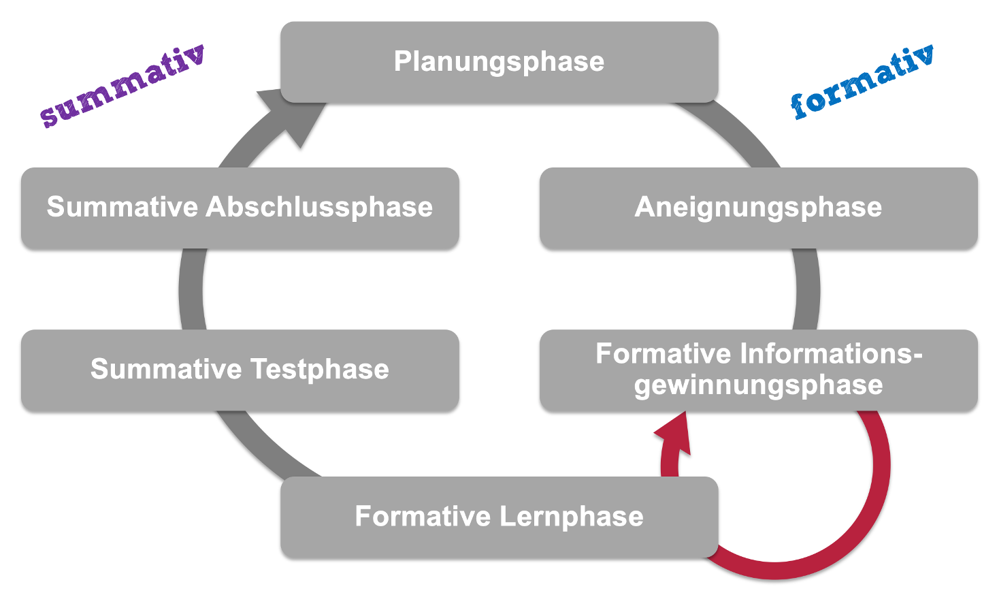

::: callout-note
## Ziele des Lernmoduls

Die Studierenden ...

-   kennen die Bedeutung von «beurteilen» und «fördern» und können beides voneinander unterscheiden.
-   kennen die Begriffe «formativ» und «summativ» und können diese im Lernen der SuS verorten.
-   erkennen, dass sowohl das Beurteilen als vor allem auch das Fördern Kreisprozesse darstellen, die auch in Kreisläufen dargestellt werden können.
-   erarbeiten sich eine differenzierte Sicht des Begriffs der «Leistung» und damit auch der «Leistungsbeurteilung».
-   entwickeln ein Bewusstsein für die Komplexität von Beurteilung & Förderung, indem Sie das sowohl widersprüchliche als auch harmonische Zusammenspiel zwischen Gerechtigkeit, Bezugsnormen und Beurteilungsfunktionen erfassen.
:::

# 1. Input zur Einführung

Mit @fig-screencast erhalten Sie eine Einführung in die Thematik und Sie lernen die Unterscheidung zwischen «summativer» und «formativer» Beurteilung kennen.

::: {#fig-screencast}
<iframe src="https://tube.switch.ch/embed/lnjJjmvJpA?title=hide" frameborder="0" allow="fullscreen">

</iframe>

Screencast zur formativen und summativen Beurteilung
:::

# 2. Input Kreisläufe

Im Wissen darum, dass sowohl das Beurteilen als vor allem auch das Fördern in Kreisprozessen ablaufen, stellen wir Ihnen in diesem Input einen **Förderkreislauf** sowie zwei stärker auf die Beurteilung ausgerichtete **Beurteilungskreisläufe** vor.

Solche Kreismodelle sollen einerseits ermöglichen die Komplexität der Thematik überschaubar zu halten und zudem helfen, aufeinander aufbauende Aspekte der Beurteilung und Förderung besser zu verstehen. Es lohnt sich deshalb auch für das eigene Beurteilungskonzept sich von solchen Modellen leiten zu lassen. Allenfalls entwickeln Sie darauf aufbauend ein eigenes Kreismodell Ihres persönlichen Beurteilungskonzeptes.

### Beurteilung im Kanton Bern

Ein spezielles Augenmerk möchten wir auf die Beurteilungssituation im Kanton Bern richten. Im Input werden wir abschliessend auch den unten abgebildeten Kreislauf vorstellen, wo sowohl das Vokabular, als auch die gesetzlichen Vorgaben des Kantons schematisch abgebildet sind. Innerhalb der beiden Beurteilungsmodulen (Formative und Summative, prognostische Beurteilung) haben sich die Dozierenden darauf geeinigt, dass wir uns im Sinne der Kohärenz und des Konsenses vor allem auf diesen Kreislauf stützen werden. Es lohnt sich deshalb für Sie, diesen kennen zu lernen. Wie bereits erwähnt, stellen wir Ihnen auch diesen Kreislauf im unten angefügten Input nächer vor.

::: {#fig-bild}

Förderkreislauf
:::

::: {#fig-förderkreislauf}
<iframe src="https://tube.switch.ch/embed/htoYUClDmN?title=hide">

</iframe>

Screencast zum Förderkreislauf
:::

## Vertiefung «Abschlussphase»

Wie im Input zu den «Kreisläufen» und dort in den Ausführungen zum «Beurteilungskreislauf» bereits hingewiesen, stellt die Rückgabe von Lernkontrollen, Tests oder Prüfungen (gemeint ist die **summative Abschlussphase**) ein eher marginalisiertes Thema dar.

Es stellen sich dabei unter anderem folgende Fragen:

-   Wie gebe ich den Test zurück? Mit welchen Worten, mit welchen Hinweisen?
-   Welche Angaben machen Sie auf Ihren Tests (Punkte, Punktedurchschnitt, Noten, Notendurchnitt, ...)?
-   Was ist mit den «Fehlern» oder den «Unkorrektheiten» die in den Tests gemacht wurden bzw. mit den «Punkten», die im Test nicht «geholt» wurden?
-   Werden die Aufgaben noch einmal besprochen? Wenn ja, mit der ganzen Klasse oder nur mit einzelnen?
-   Muss man den Test «verbessern»? Darf man nachträglich noch zeigen, dass man es eingentlich «kann» (Stichwort: Wiederholungstests)?

::: {.callout-caution collapse="true"}
## Auftrag auf LearningView

### Auftrag:

Im [folgenden Video](https://phbern365.sharepoint.com/:v:/r/sites/IS1.Z.Studienplanentwicklung2022/Freigegebene%20Dokumente/General/BA%20-%20Beurteilung%20(formativ%20und%20summativ)/Lerngelegenheiten/Grundlagen%20der%20Beurteilung%20SOL%20-%20Conrardy/Alcala,%20Leah%202015%20-%20Tch%20TeachingChannal%20-%20Highlighting%20Mistakes%20-%20A%20Grading%20Strategy.mp4?csf=1&web=1&e=opTUxg) stellt Ihnen [Alcala, Leah 2015](https://learn.teachingchannel.com/video/math-test-grading-tips) von der «Martin Luther King Middle School» in Berkeley (USA) Ihre «Strategie» vor, wie Sie bei Ihren SuS des 7. und 8. Schuljahres Tests zurückgibt.

-   Lassen Sie sich von diesem «System», von dieser «Strategie» oder von dieser Möglichkeit inspirieren und erarbeiten Sie sich Ihre eigenen Ideen, Möglichkeiten oder auch schon Strategien.
-   Bauen Sie diese schliesslich auch in Ihr Beurteilungskonzept ein.

Spannende Aussagen in diesem Video:

> «So I see that now when I give tests back they're continuing to learn.»

> «My hope is, that trough this strategy they see, that studying their mistakes and learning from their mistakes is really what learning is.»

Vorschlag für das Bibliografieren und Zitieren des Videos: Alcala, Leah 2015 - Tch TeachingChannal - Highlighting Mistakes - A Grading Strategy
:::

# 3. Input zum Leistungsbegriff

Wenn es ja «Leistungen» sein sollen, die gefördert und beurteilt werden sollen, dann ist es unerlässlich, sich im Rahmen des folgenden Screencasts über den Begriff der schulischen «Leistung» Gedanken zu machen.

::: {#fig-Leistung}
<iframe src="https://tube.switch.ch/embed/lnjJjmvJpA?title=hide">

</iframe>

Screencast zum Leistungsbegriff
:::
