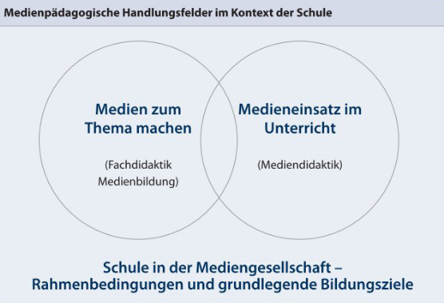
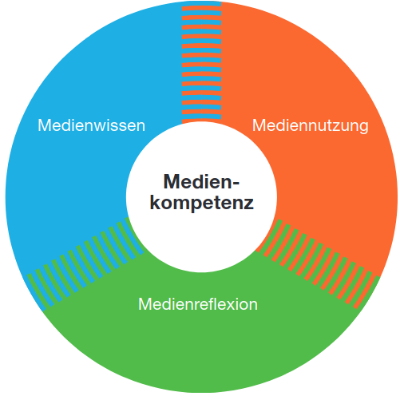
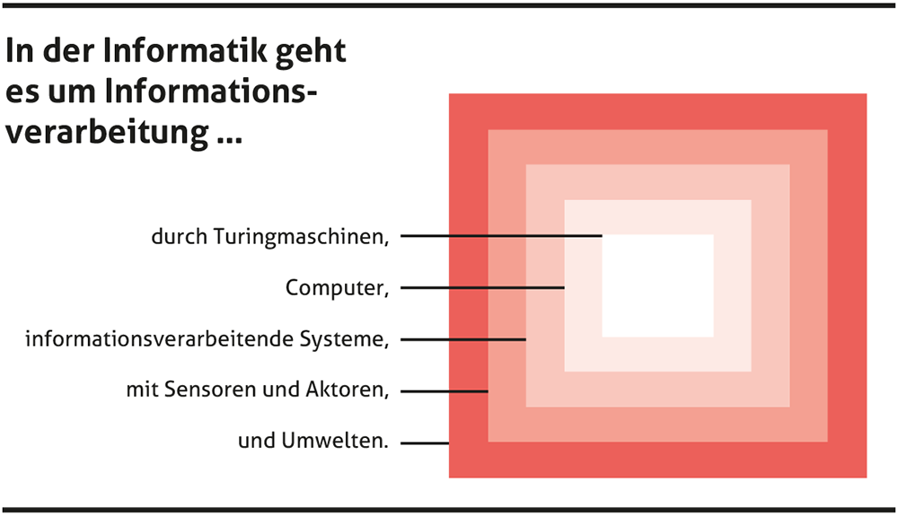
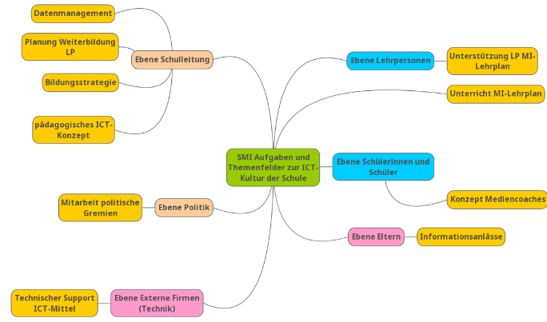

# Begriffsdefinitionen 

## 

::: {#fig-merz}

[@merz_unterricht_2012, S.6]
:::

##

::: {#def-1}
##  Medium

#### Medium als stofflicher Vermittler

Weil Stoffe Impuls und Energie übertragen, können sie auch Information übermitteln. Die Übertragung von Schall benötigt z. B. einen vermittelnden Stoff wie Luft.

#### Medium als Kommunikationsmittel

Von der stofflich vermittelten Informationsübertragung wurde der Begriff Medium auf Kommunikationsmittel beliebiger Art zwischen Sendern und Empfängern übertragen. Auch die ältere magische Bedeutung blieb in dieser Vorstellung erhalten.

::: quelle
[Wikipedia](https://de.wikipedia.org/wiki/Medium_(Kommunikation))
:::
:::

##

::: {#exr-1}
Lesen Sie in Merz et al. [-@merz_unterricht_2012, S.7] die Beschreibung der Handlungsfelder.

Halten Sie schriftlich Ihre Lernbedürfnisse fest, welche Sie in den gegebenen Handlungsfeldern haben.
:::

## Medium: Text

::: {#exr-1}
Wir

* benutzen einen Texteditor.
* schreiben eine .txt Datei.
* schreiben eine .html Datei.
* unterscheiden *Markup* von *Style*.

:::

## 

::: {#fig-ammann}

[@ammann_mit_2009, S.9]
:::

##

::: {#exr-1}
Lesen Sie in Ammann [-@ammann_mit_2009]. Vergleichen Sei den Kompetenzbegriff mit den Begriffen von Weinert [-@weinert_leistungsmessungen_2014] aus der Sekundarstufe 1 und Klieme [-@klieme ]

:::

## Was ist Informatik?

::: {#fig-doebeli}

[@dobeli_honegger_mehr_2017, CC BY-SA 4.0]
:::

## Definition

::: {#def-inf}

Informatik ist die Wissenschaft der strukturierten und automatischen Informationsverarbeitung.

::: quelle
[@dobeli_honegger_mehr_2017, S.85]
:::

:::

## Themen der Informatik

* Angewandte Informatik
* Technische Informatik
* Praktische Informatik
* Theoretische Informatik

## Medien bildung, Informatik und Anwendungskompetenzen sind nicht dasselbe

* Informatik
  * Auto bauen & entwickeln
* Anwendungskompetenzen
  * Auto bedienen
* Medienbildung
  * Verkehrsgerecht fahren

##

::: {#exr-1}

Erklären Sie ihrem Sitznachbarn das gesetzeskonforme (verkehrsgerechte) parkieren im Hang.
:::

##  


::: {#exr-1}
## Doppelgänger

Lesen Sie sich in die Doppelgänger Kampagne ein [@bayerisches_landesamt_fur_verfassungsschutz_doppelganger_2024].

Lesen Sie insbesondere S.16.
:::

# Medienderfahrung von Jugendlichen

## James Studie

[@kulling-knecht_ergebnisbericht_2024]
:::

## Jungendschutz

### Crypto Wars

Soll der Staat die Möglichkeit erhalten in private Kommunikationskanäle mitzulesen um insb. Pädokriminalität zu bekämpfen?

### Alterssperren

Sollen Platformen sicherstellen müssen, dass Kinder keine gefährdenden Inhalte zu sehen bekommen (vgl. Australien)?

## Hash-Functions

#### Problemstellung

Anbieter muss Passwort vergleichen können ohne das Passwort zu besitzen. Wie geht das?

. . .

#### Gesucht

- One-way-function
- collision resistance

#### Beispiele

MD5, SHA-256, ... 

## Reality Check

1. Passwort
2. Salt
3. 100'000 Hash-Iterationen -> Hash
4. Speichere *Salt* und *Hash*
5. Beim Login wird das Passwort mit dem Salt verbunden, gehasht und der Hash verglichen.

::: {.callout-note}
## Cryptographic Hash Function

CHF haben noch viele andere praktische Anwendungen!
:::

# Organisation der ICT an Schulen

## Wunschausstattung

* Welche Ausstattung (Hard-/ Software) würde Ihre Arbeit als Lehrperson optimal unterstützen?
* Welche Unterstützung wünschen Sie sich von der Schule?

## Zuständigkeit

> Daraus ergibt sich auch die Zuständigkeit der Gemeinden für die Einrichtung der Schulen mit Netzwerken, Servern und Geräten für die Schülerinnen und Schüler, sowie für die Lehrpersonen. Das gleiche gilt für die Lehrmittel."
>
> 
::: quelle
@amt_fur_kindergarten_volksschule_und_beratung_akvb_infrastruktur_nodate
:::

## Empfehlungen

> Die Nutzung von digitalen Informations- und Kommunikationstechnologien hat sich neben Lesen,
Schreiben und Rechnen als Grundkompetenz in der Gesellschaft etabliert.
>
> Gemeindebehörden fordern von den Schulen das Erarbeiten und die periodische
Überprüfung eines ICT-Konzeptes, [...]

:::quelle
@erziehungsdirektion_des_kantons_bern_medien_2016
:::

## 


::: {#exr-1}
## Kantonale Empfehlungen

Lesen die kantonalen Empfehlungen.[@erziehungsdirektion_des_kantons_bern_medien_2016]
:::

## Weitere Empfehlungen

* Arbeitsgeräte der Schülerinnen und Schüler
* Arbeitsgeräte für Lehrpersonen
* Vernetzung innerhalb der Schule und Bandbreiten ins Internet
* Datenablage
* Peripheriegeräte
* Lizenzen und Nutzungsverträge

:::quelle
@erziehungsdirektion_des_kantons_bern_medien_2016
:::

##

::: {#fig-smi}

Spezialistin/Spezialist Medien und Informatik (SMI) [@erziehungsdirektion_des_kantons_bern_pflichtenheft_2018, S.3]

:::

## Kosten {.smaller}

| **Kategorie**              | **Element**                                       | **Anzahl** | **Kosten (CHF)**    |
|----------------------------|---------------------------------------------------|------------|---------------------|
| **Schülergeräte**          | Chromebooks                                      | 275        | 123'750.00         |
|                            | MacBook Air                                      | 30         | 33'870.00          |
|                            | Kopfhörer, Drucker, Chromecast (div.)            | -          | 6'080.00           |
| **Software/Lizenzen**      | Chrome OS EDU Lizenzen (Chromebooks)             | -          | -                  |
|                            | G Suite Enterprise for EDU Lizenzen (Lehrpersonen)| -          | -                  |
|                            | MS Office 365 Lizenzen (Unterrichtsvorbereitung) | -          | 11'100.00          |
| **Totalkosten Sekundarstufe I** | -                                                | -          | **174'800.00**     |

::: quelle
[@grosser_gemeinderat_zollikofen_auszug_2020, S.3f]
:::

##

:::{#def-1}

## Prozessorarchitektur
Die Prozessorarchitektur bezieht sich auf die spezifische Struktur und Organisation eines Prozessors, der ein wesentlicher Bestandteil von Computern und anderen elektronischen Geräten ist
:::

::: quelle
[Wikipedia](https://de.wikipedia.org/wiki/Prozessorarchitektur)
:::

Beispiele: 

x64, ARM, RISV-V

# ICT-Konzepte

## 

::: {#exr-1}
## ICT-Konzepte

1. Lesen Sie 2 ICT Konzepte durch. 
2. Was stellen Sie fest?
:::

## Bibliographie