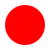
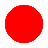
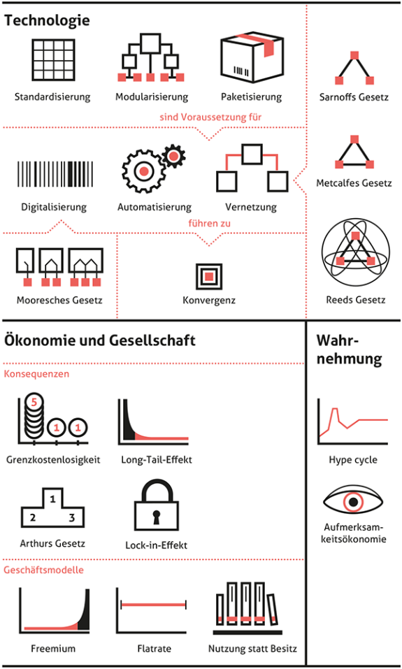

#  Erklär- und Lernvideos 

## 
::: {#exr-1}
## Lehr-Lernfilm

Informieren Sie sich über [Lehr-Lernfilme auf Digileb](https://digileb.phbern.ch/medien-gestalten-und-nutzen/medien-gestalten/lehr-lernfilm/).
:::

::: {#exr-1}
## Lehr-Lernfilm

Nehmen Sie ein Lernvideo für nächstes Mal auf und halten Sie fest, wie Sie es mit einer Klasse teilen.
:::

#  Kollaboration und Kooperation 

##

:::{#def-1}

### Kollaboration 

> Collaboration is a coordinated, synchronous activity that is the result of a continued attempt to construct and maintain a shared conception ofa problem.
>

::: quelle

[@roschelle_construction_1995, S.70]

:::

:::

## {.smaller}

::: {#def-1}

### Kooperatives Lernen 

> Beim kooperativen (kollaborativen) Lernen arbeiten Schülerinnen und Schüler gemeinsam in kleinen Gruppen, um sich beim Aufbau von Kenntnissen und beim Erwerb von Fertigkeiten gegenseitig zu unterstützen. Das kooperative ist ein aktives, selbständiges und soziales Lernen. Kooperative Lehrformen sind lernerzentriert, denn während des Lernprozesses tritt die Lehrperson im Allgemeinen in den Hintergrund. Mindestens zwei, meist aber drei bis fünf Lernende konstituieren eine Lerngruppe.
>

::: quelle

[@hasselhorn_padagogische_2013, S.308]

:::

:::

[vgl, @schulz_diklusive_2021]

## Werkzeuge

:::{#exr-1}
Halten Sie fest in welchen digitalen Werkzeug Sie 
:::

# Graphiken

## SVG

::: {#exr-1}
Zeichnen Sie einen Kreis auf dem Computer.
:::

. . . 

:::{#fig-1}

:::

. . .

``` svg
<svg width="100" height="100" xmlns="http://www.w3.org/2000/svg">
  <circle cx="50" cy="50" r="40"/>
</svg>
``` 

##

::: {#exr-1}
Zeichnen Sie einen roten Kreis auf dem Computer mit einem schwarzen horizontalen Strich.
:::

. . .

:::{#fig-1}

:::

. . .

``` svg
<svg width="100" height="100" xmlns="http://www.w3.org/2000/svg">
  <circle cx="50" cy="50" r="40" fill="red" />
  <line x1="10" y1="50" x2="90" y2="50" stroke="black"/>
</svg>
```

##

::: {#exr-1}
Zeichnen Sie einen roten Kreis auf dem Computer mit einem schwarzen horizontalen Strich. Der Strich dreht sich im mathematisch negativen Sinn im Kreis. Eine volle Rotation benötigt 2 Sekunden.
:::

. . .

:::{#fig-1}

:::

. . .

``` svg
<svg width="100" height="100" xmlns="http://www.w3.org/2000/svg">
  <!-- Red Circle -->
  <circle cx="50" cy="50" r="40" fill="red" />
  
  <!-- Rotating Red Line -->
  <line x1="10" y1="50" x2="90" y2="50" stroke="black">
    <animateTransform 
      attributeName="transform"
      type="rotate"
      from="0 50 50"
      to="360 50 50"
      dur="20s"
      repeatCount="indefinite" />
  </line>
</svg>

```

## 

::: {#exr-1}
## Reales Beispiel

Ändern Sie die Farben gemäss den Corporate Design der PHBern (bzw. ihres Arbeitgebers).
:::

:::{#fig-1}


:::

## Farben

::: {#thm-1}
Bildschirme bestehen aus einem Raster an Pixeln. Pixel bestehen aus Subpixeln, welche Rot, Grün oder Blau darstellen können.
:::

:::{#fig-1}


[Pixelgeometrie, CC BY-SA 3.0, Pengo](https://commons.wikimedia.org/wiki/File:Pixel_geometry_01_Pengo.jpg)
:::

##

::: {#thm-1}
Farben werden als eine Mischung von Rot, Grün und Blau gespeichert. Jede Farbe kann `Integers` zwischen 0 und 255 annehmen (8 bit Farbtiefe).
:::

::: {#cor-1}
Zwei Farbformate sind typisch:

1. `rgb(5, 11, 16)`
2. `#050B10` (Hexadezimal)
:::

::: {#cor-1}
Falls Teile transparent sein sollen, wird ein *Alpha-Channel* hinzugefügt.

`rgba(255,0,0,0.7)`, ist 30% transparent (durchlässig).
:::


## 

::: {#exr-1}

Zeichnen Sie das Bundeshaus. 
:::
::: {#fig-1}


[Bundeshaus Bern, CC-BY 2.0, Flooffy](https://commons.wikimedia.org/wiki/File:Bundeshaus_Bern_2009,_Flooffy.jpg)
:::

. . .

😰😰😰


## Rastergraphik

::: {#fig-1}


Rastergraphik erklärt
:::

:::{.callout-tip}

Rastergraphiken sind (fast) nie *plaintext* sondern meist *binär*. Zudem machen sie stark von *Datenkompression* gebrauch, diese kann *lossy* oder *lossless* sein.

:::

## Fazit

SVGs sind kleiner, "unendlich" scharf und vielseitig. 

Aber:

Sie eignen sich nicht für jede Darstellung, können aufwändig sein und bergen Risikopotential (integrierter Schadcode).

#  Webseiten im Unterricht 

## Beispiele

* Googlesites ("dynamisch")
* Wordpress (dynamisch)
* Quarto (statisch)

## Web-Computersprachen

### Clientseitig

* Markup: HTML
* Style: CSS
* Programme: Javascript

### Serverseitig

* Programme: PHP
* Datenbankabfragen: SQL


# Empfehlungen aus der Praxis

##

:::{fig-1}
<iframe width="640" height="360" src="https://tube.switch.ch/embed/z30Z5zJ7Os" frameborder="0" allow="fullscreen"></iframe>

Input Stefan Knecht (2022)
:::

:::{#exr-1}

Hören Sie den Vortrag.

In wiefern kommen *die gesetze des Digitalen* [vgl. @dobeli_honegger_mehr_2017] hier zum tragen?

:::

## 

::: {#fig-1}


Die Gesetze des Digitalen im Überblick, [CC BY-SA 4.0](https://creativecommons.org/licenses/by-sa/4.0/deed.de), @dobeli_honegger_mehr_2017

:::

## Bibliographie