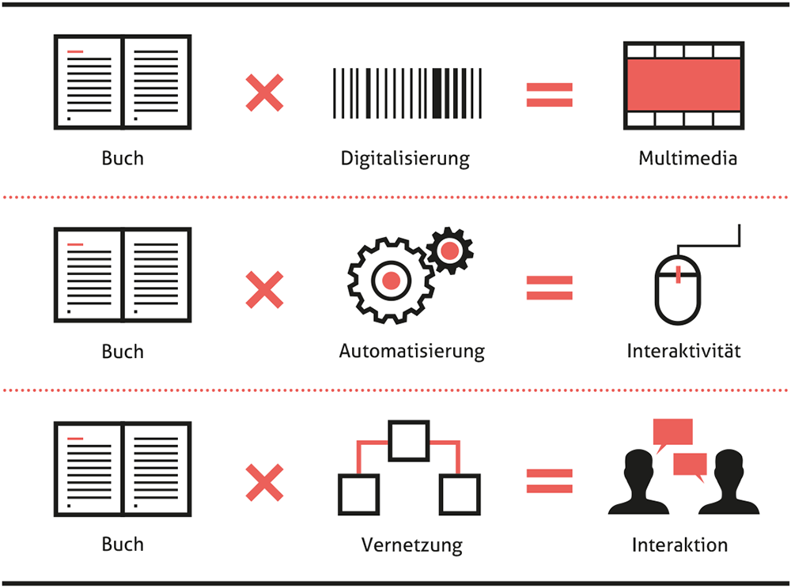
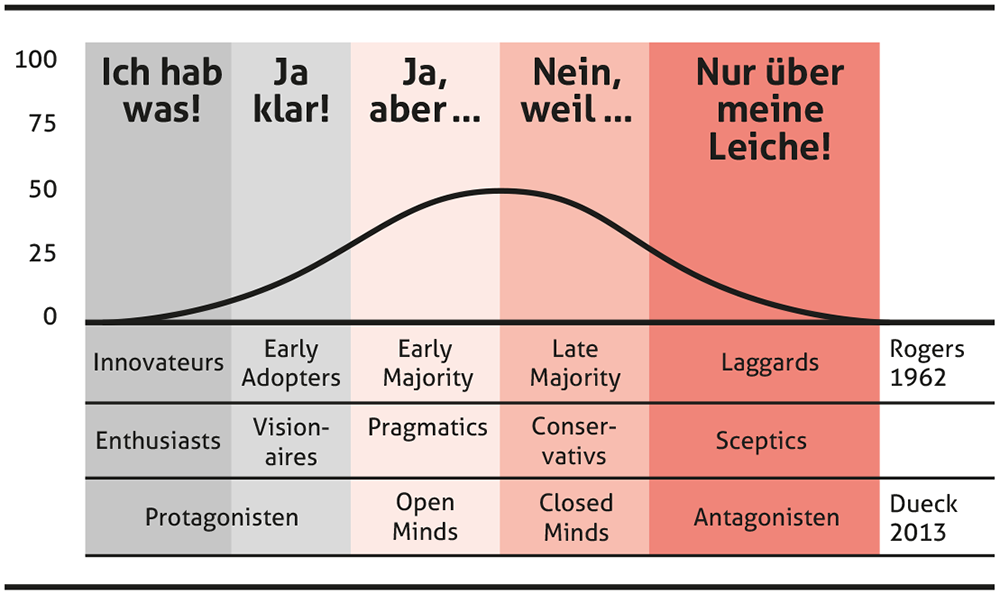
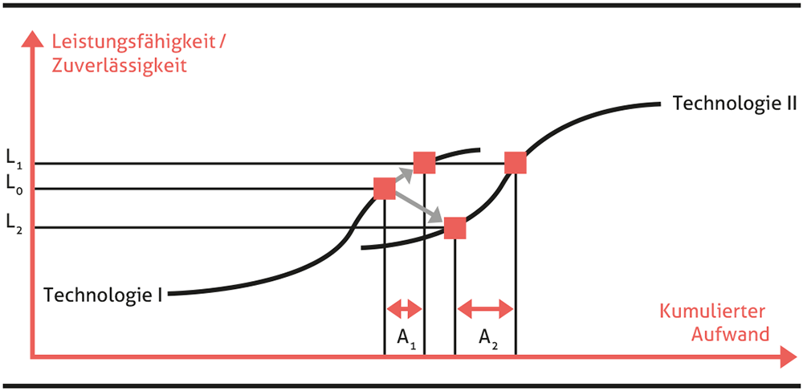
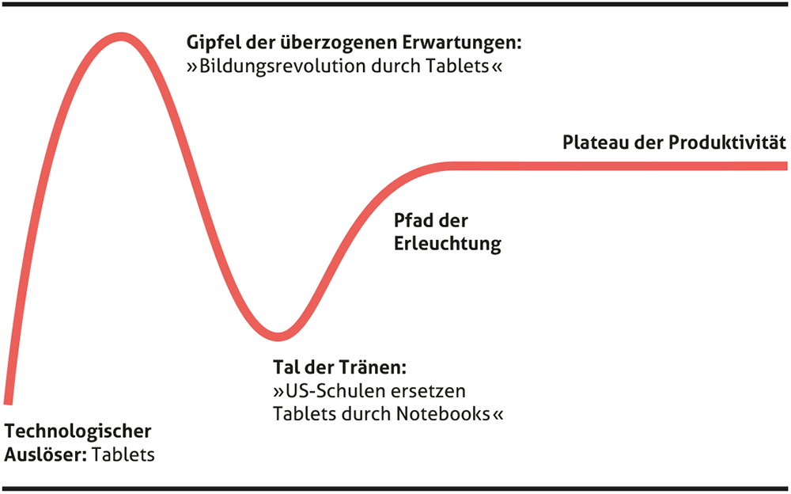
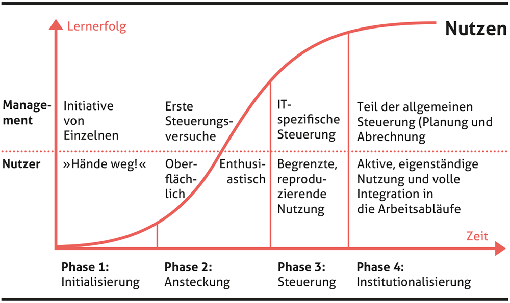

# Learning Management Systeme

##

:::{#fig-1}

Potenziale digitaler Schulbücher, [CC BY-SA 4.0](https://creativecommons.org/licenses/by-sa/4.0/deed.de), @dobeli_honegger_mehr_2017
:::

## Notwendige Kriterien

* Eine Benutzerverwaltung  
* Eine Kursverwaltung  
* Eine Rollen und Rechtevergabe mit differenzierten Rechten  
* Kommunikationsmethoden und Werkzeuge für das Lernen  
* Die Darstellung der Kursinhalte, Lernobjekte und Medien in einem netzwerkfähigen Browser.

::: quelle
[@schulmeister_lernplattformen_2005, S.55]
:::

##

:::{#fig-1}

Innovationstypen nach Rogers 1962, [CC BY-SA 4.0](https://creativecommons.org/licenses/by-sa/4.0/deed.de), @dobeli_honegger_mehr_2017
:::

## Klassische Open-Source LMS

::::{.columns}
:::{.column width="40%"}

:::{#fig-1}

Logo Moodle
:::
:::
:::{.column width="40%"}
:::{#fig-1}

Logo MS-Teams
:::
:::
::::

## LearningView

:::{#fig-1}

Logo LearningView
:::

## Microsoft 

::::{.columns}
:::{.column width="40%"}

:::{#fig-1}

Logo MS-Teams
:::
:::
:::{.column width="40%"}
:::{#fig-1}

Logo MS-Teams
:::
:::
::::

## Google Classroom

:::{#fig-1}

Logo Google Classroom
:::

## Weitere

* [Lernpfad](https://lernpfad.ch)
* [Graasp](https://graasp.org/)
* ...

##

:::{#fig-1}

Strategische Technologie-Entscheidungssituationen nach Foster 1986, [CC BY-SA 4.0](https://creativecommons.org/licenses/by-sa/4.0/deed.de), @dobeli_honegger_mehr_2017
:::

## Ai-generated

* [Khanmigo](https://www.khanmigo.ai/)
* ...



##

:::{#fig-1}

Der hype cycle am Beispiel von Tablets in der Schule, [CC BY-SA 4.0](https://creativecommons.org/licenses/by-sa/4.0/deed.de), @dobeli_honegger_mehr_2017
:::

:::{#fig-1}

Phasenmodell der organisationalen Lernkurve bei der Einbettung von ICT in Schulen nach Breiter 2001, [CC BY-SA 4.0](https://creativecommons.org/licenses/by-sa/4.0/deed.de), @dobeli_honegger_mehr_2017
:::

## Bibliographie