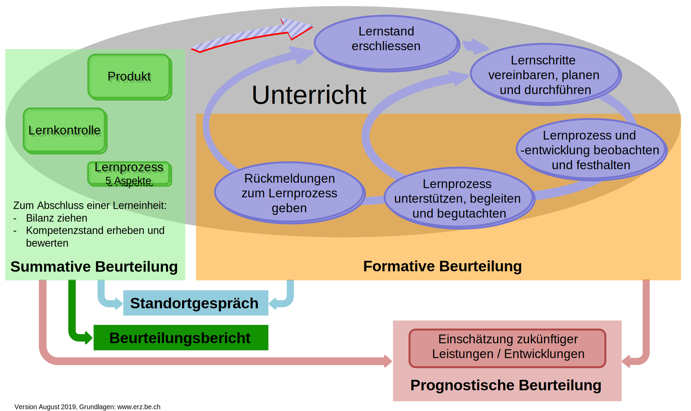

# Organisatorisches

## Organisationsblatt

 

::: {style="text-align: center;"}
[Organisationsblatt](){.knopf target="_blank" }
:::

# Theorie

## Grundlagen{.smaller}

::: columns
::: {.column width="50%"}
#### Art.3 DVBS

Die Beurteilung ist

a.  förderorientiert,
b.  lernzielorientiert,
c.  umfassend, \[...\]
d.  transparent und nachvollziehbar.

::: blockquote-footer
@erziehungsdirektiondeskantonsbern2022
:::
:::

::: {.column width="50%"}
#### Qualitätsmerkmale einer kompetenzorientierten Beurteilung

-   Förderorientierung: \[...\]
-   Passung zum Unterricht: \[...\]
-   Transparenz / Nachvollziehbarkeit: \[...\]
-   Umfassende Beurteilung: \[...\]

::: blockquote-footer
@erziehungsdirektiondeskantonsbern2016
:::
:::
:::

## Constructive Alignment

The model of instruction that emerges is simple, and it makes intuitive sense:

-   teachers need to be clear about what they want their students to learn, and how they would manifest that learning \[...\]
-   students need to be placed in situations that are judged likely to elicit the required learnings.
-   students are then required to provide evidence, either by self-set or teacher-set tasks, \[...\]

::: blockquote-footer
[@biggs1996 S.30-31]
:::

## Förderkreislauf

{width="100%" fig-align="center"}

## Kriterien zur Auswahl von Schulstoff

-   Der Lehrstoff muss mathematisch richtig sein.
-   Der Lehrstoff muss spatere Erweiterungen vorbereiten.
-   Der Lehrstoff muss an den Anfangszustand der SchUler anknüpfen.
-   Der Lehrstoff muss den gestellten Zielen entsprechen.

::: blockquote-footer
[@vandormolen1978, S.36]
:::

# Projektarbeit

## Auftrag auf Woche 8

<iframe src="https://phbern-rconrardy.quarto.pub/math_summative_praes/math_summ_praes.html" width="100%" height="50%" frameborder="0" allowfullscreen></iframe>

## Bibliographie {.unnumbered .unlisted}
